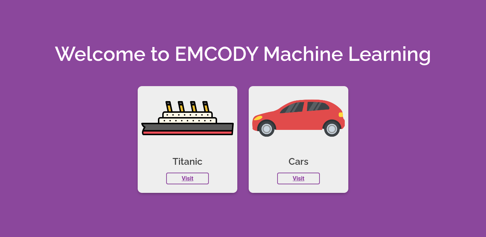
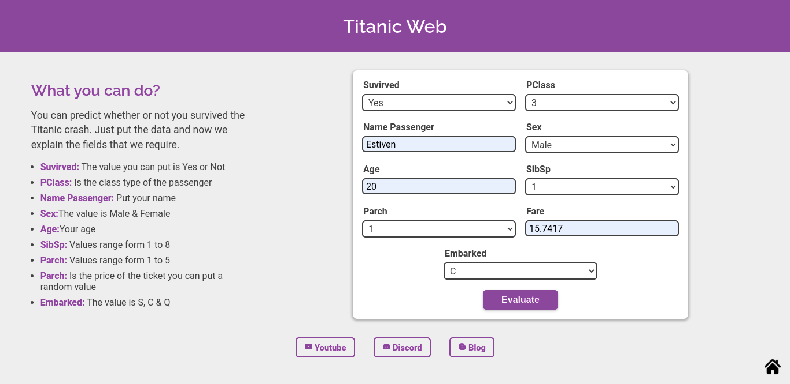
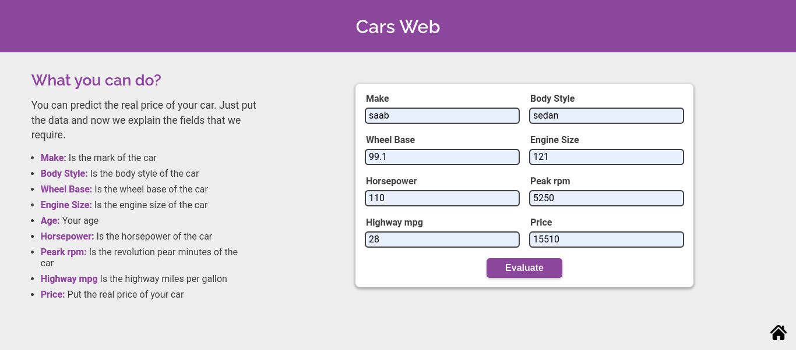

# **APP Machine Learning**

This is an application created by **EMCODY**. It is a web platform who has the purpose help other developers.

Now, In this app, you will find examples of predictive models apply **machine learning**. We are consume an API ML and create an API REST with Node.js.

> In the **Titanic** section we use a machine learning model to predict **whether a passenger survived or did not survive**

> In the **Cars** section we use a machine learning model to predict **The real price of a Car**

## **Titanic Test Data**

> You can use this data to predict if passenger survived

| Survived | PClass | Sex    | Age | SibSp | Parch | Fare    | Embarked |
| -------- | ------ | ------ | --- | ----- | ----- | ------- | -------- |
| 1        | 3      | male   | 20  | 1     | 1     | 15.7417 | C        |
| 1        | 2      | female | 25  | 1     | 1     | 30      | S        |
| 0        | 3      | male   | 28  | 0     | 0     | 7.8958  | C        |
| 1        | 3      | female | 28  | 1     | 1     | 22.3583 | C        |
| 0        | 3      | male   | 28  | 0     | 0     | 9.5     | S        |
| 0        | 1      | male   | 29  | 0     | 0     | 30      | S        |
| 1        | 1      | male   | 49  | 1     | 0     | 56.9292 | C        |
| 1        | 3      | male   | 24  | 0     | 0     | 7.1417  | S        |

## **Cars Test Data**

> You can use this data to predict the real price of your car

| Make       | Body style | wheel base | Engine size | Horsepower | Peak rpm | Highway mpg | Price |
| ---------- | ---------- | ---------- | ----------- | ---------- | -------- | ----------- | ----- |
| saab       | sedan      | 99.1       | 121         | 110        | 5250     | 28          | 15510 |
| mitsubishi | hatchback  | 93         | 98          | 102        | 5500     | 30          | 7689  |
| volkswagen | sedan      | 97.3       | 109         | 85         | 5250     | 34          | 8195  |
| chevrolet  | hatchback  | 94.5       | 90          | 70         | 5400     | 43          | 6295  |
| isuzu      | hatchback  | 96         | 119         | 90         | 5000     | 29          | 11048 |

## **Technologies**

- HTML5
- CSS3
- JavaScript
- [API Machine Learning](https://github.com/EstivenMayhuay/API_Azure_Machine_Learning)

## **Views**

**Home**

**Titanic**

**Cars**

